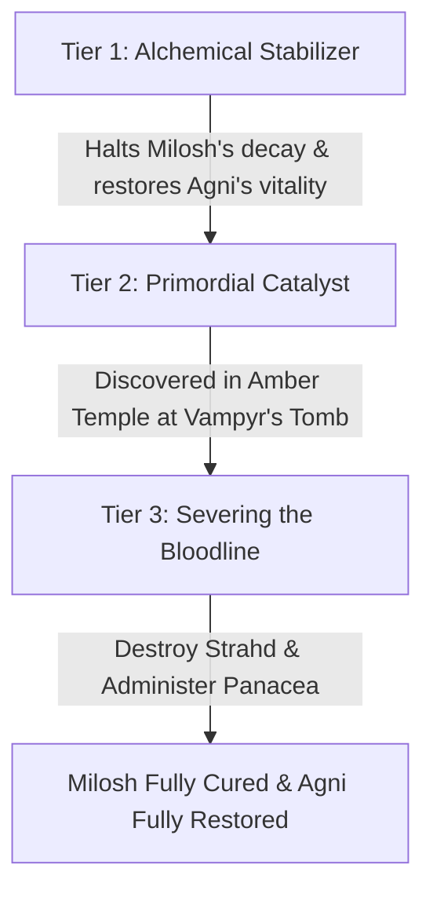

# Agni Vidar: DM Campaign Planning & Lore (DM Notes)

> [!warning] DM-only canon
> This document contains mutable planning material for the DM. It is not player-facing canon. Details become fixed only when they are deliberately revealed in play or copied into a player document.

---

## 1. The Personal Antagonist: Lord Cassian von Holtz

### Identity & Background
* **Name & Title:** Lord Cassian von Holtz (frequently adopting the alias "Vasili" or "Vasili von Holtz" as a mocking tribute to ancient Barovian aristocracy).
* **Role:** An elder vampire spawn and master alchemist serving in Castle Ravenloft. Centuries ago, prior to his turning, Cassian was a noble physician obsessed with humoral alchemistry, blood transmission, and the threshold between mortal vitality and undead preservation.
* **Relationship to Strahd:** Cassian was turned by Strahd directly. While fanatically loyal, Cassian considers himself a scientist and artist of the blood, working under Strahd’s broader patronage (and occasionally collaborating with Ludmilla Vilisevic on arcane pathology).

### The Soft Blood Connection
* Agni is not a vampire spawn and is not bound to obey Cassian or Strahd. Cassian cannot issue supernatural commands to him, force him to return, or compel him to feed.
* Cassian's experimental strain does leave a weaker connection between them. When Cassian deliberately pulls on it, Agni may experience a sudden hunger spike, intrusive memories of Widow's Peak, dreams in Cassian's voice, or an unstable flare of his vampiric senses.
* The connection works in both directions. Agni can sometimes sense Cassian's proximity or use the flare of hunger as a trail toward him. Cassian can sense when Agni resists, but cannot decide what Agni does.
* The connection is strongest near Cassian, during extreme thirst, or when Cassian has access to Agni's blood. It should appear at important story moments rather than constantly interrupting play.
* Cassian treats the connection as proof that Agni is his creation and property. Agni's refusal to obey is therefore a direct humiliation to Cassian and a central part of their rivalry.

### Cassian's Pull: Table Mechanic
* **Trigger:** Once per long rest, Cassian can pull on the connection when he is within 120 feet of Agni, is handling Agni's blood, or is using an alchemical sample taken from Agni. The DM should describe the pull before asking for a decision: the taste of Widow's Peak wine, Mavis's blood on the floor, or Cassian's voice inside the hunger.
* **Resist:** Agni makes a Wisdom saving throw against his Blood Frenzy save DC. On a success, the connection breaks for the encounter and Agni senses Cassian's direction for 1 minute. On a failure, Agni loses 1d6 Thirst Points. Cassian does not learn Agni's location when Agni resists.
* **Lean into it:** Agni can accept the connection without making the saving throw. For 10 minutes, Blood Sense remains active, Agni knows Cassian's exact direction and distance, and Cassian cannot hide from Agni through darkness, invisibility, or total cover. Agni also has advantage on attack rolls and ability checks made directly against Cassian during this time. Cassian immediately knows Agni's direction and general distance.
* **Limits:** Cassian's Pull never forces Agni to move, attack, feed, reveal information, or obey a command. It cannot make Agni drink living humanoid blood and does not by itself move him across the permanent threshold. If Agni has fed on living humanoid blood, this mechanic should be revised before being used again.
* **Reward for resistance:** Whenever Agni resists the pull successfully, record one **Defiance** mark for the rivalry. Defiance marks are narrative evidence that Cassian's experiment did not control Agni; they can later give Agni leverage in the confrontation with Cassian or cause Cassian to make a reckless mistake.

---

## 2. The Widow’s Peak Experiment

### The Century of Slumber (~635–735 B.C.)
* During Strahd's century-long hibernation in Castle Ravenloft, his court lacked active direction. Many high-ranking vampires and spawn dispersed across and beyond the valley to pursue personal obsessions.
* Cassian was fascinated by the inherent physiological limitations of vampirism: sunlight hypersensitivity, running water vulnerability, the need for full death/rebirth, and the psychic leash of the master vampire.
* For most of the century, Cassian refined his blood-alchemy in stages, testing diluted strains on animals, corpses, and mortal populations in several remote settlements beyond Barovia. The earlier village cohorts failed: subjects died, became feral, or lost the altered blood before it could stabilize. Cassian kept the work hidden from Strahd, partly to avoid punishment for unauthorized experimentation and partly because he wanted to present a finished breakthrough rather than a series of failures.
* **Widow's Peak was the latest cohort, not the beginning of the experiment.** Cassian chose the remote hamlet because its small population, isolated location, and close-knit tavern culture allowed him to dose a controlled group without attracting attention. The two or three months before Agni's awakening were the observation period for his most promising formula.
* Cassian's failed trials suggested that the formula needed a major surge of vampiric power to cross the threshold from contamination into a stable transformation. He had planned a smaller activation event for Widow's Peak: a carefully prepared blood ritual that would expose the village to a controlled pulse and let him observe the results. He was increasingly confident that Agni's household was the strongest candidate, but he had not yet proved the process worked.
* The detailed chronology, locations, and surviving evidence from the earlier failed cohorts belong in Cassian's future research notes. This document records only the campaign-relevant conclusion: Widow's Peak was the last attempt and the first apparent success.
* Seeking to synthesize a stable strain of day-walking, resilient thralls (**Dhampirs**), Cassian crossed beyond the thinning perimeter of the Mists and used the remote hamlet of **Widow’s Peak** as the final testing ground for his tainted vintages.

### The Infiltration & The Tainted Vintage
* Posing as an affable, elderly villager named **"Vasili"**, Cassian opened a small tavern out of a shack next to his house to serve the hamlet's ~22 residents.
* Over several months, he served his experimental vintage—a blend of distilled vampire ichor, dark alchemical reagents, and fermented wine—to the villagers as a communal social beverage.
* **The Regular Patrons:** 
  * Agni was the village's unofficial protector and a frequent patron, drinking the tainted wine almost daily.
  * Young Milosh occasionally accompanied his father and was given a "special, slightly alcoholic" sweet concoction brewed by Vasili.
  * Mavis, exhausted from tending farm animals, rarely visited and never drank, leaving her completely untainted by the contagion.
  * Other villagers who frequented the tavern also consumed the tainted drinks over those months.

### The Sudden Recall & The Village-Wide Awakening (~3 Months Ago)
* When Strahd awoke from his slumber, his psychic and blood summons reached his actual spawn and servants, demanding their immediate return to Castle Ravenloft. Cassian received that command; Agni did not.
* Cassian had designed the final formula to remain dormant until it received a strong pulse from the master vampire's bloodline. He expected to trigger and observe that final phase himself using the smaller activation event he had prepared for Widow's Peak. Strahd's unexpected awakening sent a far larger pulse months early, at the same moment that the recall forced Cassian to return.
* Cassian was forced to abandon Widow’s Peak immediately. The village-wide awakening was therefore a rushed and uncontrolled final test that replaced his planned ritual, not a convenient appointment Cassian had arranged with Strahd. He had no time to separate successful subjects, administer counteragents, or learn whether the process could be reversed.
* **The Horror of the Awakening & The Divergence:**
  * The villagers who drank the wine awoke in their homes gripped by ravenous, uncontrollable blood-hunger.
  * In Agni's home, both Agni and young Milosh awoke starving. While Agni stepped outside to fetch meat from the tavern, the hunger overwhelmed the boy: Milosh fed directly on his own mother, Mavis.
  * Outside, Cassian stood before his tavern, dropping his elderly guise to reveal his true vampiric form and grinning as lights flickered on across the doomed village.
  * When Agni raced back home, he found Mavis dead in a pool of blood with Milosh asleep in her arms, face drenched in her blood. Agni resisted feeding directly on living flesh; in desperate grief, he harvested what remained of Mavis's blood into a stash to keep his own hunger at bay without taking a living humanoid's life.
* **The Crucial Distinction Between Father and Son:**
  * **Milosh (The Sealed Threshold):** Because Milosh directly drank living humanoid blood during the awakening, the vampiric strain fully locked into his developing body. His affliction is deep and permanent unless cleansed through all 3 stages of the cure (the Stabilizer, the Amber Temple Catalyst, and Strahd's death).
  * **Agni (The Unsealed Threshold):** Agni has **not** taken a living humanoid's blood. His Dhampir state remains conditional and unsealed. As long as he upholds his vow and refuses to feed on humanoid life, his body can still be directly saved/cured. However, if Agni ever gives in to Blood Frenzy and feeds on living humanoid blood, he crosses the permanent threshold just like his son.

### The Mists and Milosh
* The Mists surround Barovia and return ordinary creatures to the domain if they try to leave. Teleportation, *plane shift*, and similar transport magic cannot bypass this boundary. A cross-planar communication spell such as *sending* can reach outside the domain, but it has the normal 5 percent chance to fail and cannot transport anyone or anything. Agni therefore cannot visit Milosh or bring Milosh into Barovia while the Mists remain.
* The Vistani are the exception. Strahd's ancient permission allows Vistani creatures to cross the Mists freely, and allows them to carry letters, medicine, and other objects. This permission is not transferable: a non-Vistani creature traveling in a Vistani wagon or caravan is still rejected by the Mists. An open gate is not proof that the passenger has permission to leave.
* The Vistani can bring outsiders into Barovia because entering the domain and leaving it are not equivalent. The Mists draw outsiders inward freely, while the Dark Powers' prison prevents non-Vistani creatures from crossing outward. The Vistani who bring the party in are not granting the party an exit route.
* Strahd could grant a specific non-Vistani creature permission to leave, but that is a concession he controls, not a service the Vistani can sell. He has no reason to release Agni while Agni is pursuing Cassian or threatening his plans.
* Before Agni entered the Mists, he left Milosh with surviving neighbors in Widow's Peak and gave them the blood he had preserved from Mavis. That supply is finite. The neighbors can keep Milosh alive for a short time, but they cannot understand or treat the condition.
* The party must earn the trust of a neutral Vistani caravan, preferably Stanimir's group at Tser Pool. Stanimir, Radu, or Elisabeta can carry sealed letters and doses of the Blood-Stasis Philter out of Barovia, then return with a written reply or a report from the caretakers. Arrigal and Luvash's camp should not be used for this service unless the party knowingly accepts betrayal risk.
* Each delivery creates a real, limited interaction with Milosh: Agni writes questions, promises, and instructions; the courier reads them to Milosh; and the courier returns with Milosh's words, drawings, changes in behavior, and requests. If the party gains access to *sending*, Agni can use it for an occasional emergency conversation, but the 25-word limit and 5 percent failure chance make it unreliable for treatment or sustained contact. The replies should show Milosh as a frightened child who still recognizes his father, not as a passive cure objective.
* After the Mists part following Strahd's defeat, Agni can travel back to Widow's Peak and speak with Milosh directly. The final cure should be administered in person, allowing Milosh to choose whether to trust the panacea and giving Agni the reunion his quest has promised.

---

## 3. The 3-Tiered Cure for Milosh & Agni

The cure is designed as an escalating, multi-act restorative quest that combines **inter-party alchemical collaboration with Sister Elga**, **ancient lore from the Amber Temple**, and **the ultimate defeat of Strahd von Zarovich**.

### The Two Paths to Salvation
1. **For Agni (Unsealed Threshold):** Because Agni has maintained his restraint and never drank living humanoid blood, the alchemical *Blood-Stasis Philter* (Tier 1) combined with the severed bloodline upon Strahd's defeat (Tier 3) is enough to fully purge the taint from his body and return him to mortal life. 
2. **For Milosh (Sealed Threshold):** Because Milosh drank living humanoid blood, his affliction has fused with his spiritual essence. Saving him requires **all three tiers**:
   - **Tier 1 (The Stabilizer):** Keeps him alive and prevents feral degeneration.
   - **Tier 2 (The Catalyst):** The *Rite of Severed Ichor* from the Amber Temple to unlock the deep metaphysical transmutation.
   - **Tier 3 (Severing the Root):** Slaying Strahd to release the supernatural hold on the bloodline.

### Tier 1: The Blood-Stasis Philter (Alchemical Collaboration with Sister Elga)
* **The Problem:** Back in Widow's Peak, young Milosh’s developing body is in danger of deteriorating into a feral beast or wasting away from starvation without regular blood.
* **The Solution:** In Vallaki, Agni recovers Cassian's research notes, a small distillation apparatus, and one sealed ampoule of stabilized vampire ichor from the auxiliary laboratory. The notes reveal that Cassian adapted the guide's **Potion of Vitality** into a weaker, safer stabilizer rather than a cure. The relevant brewing rules are in [Potion Brewing and Ingredient Gathering](../sister_elga/potion_brewing.md).
* **Sister Elga's Role:** Sister Elga is proficient with the appropriate kit, not an expert. She can learn and attempt the simplified common recipe with Agni's help, but the party must gather the ingredients and accept the possibility of failure. Agni's knowledge of his own symptoms supplies the missing practical observations; it does not replace Elga's brewing check.

#### Recipe and Ingredients
* **Morning Dew, 2 leaves:** Gathered at dawn in the Svalich Woods, especially around Tser Pool. It is a common ingredient: Nature/identification DC 10, then Herbalism Kit harvest DC 10.
* **Cat's Tongue, 2 pods:** Found among the herbs and vines in the Wachterhaus garden in Arc F, or in untended fields outside Vallaki. It is a common ingredient: Nature/identification DC 10, then Herbalism Kit harvest DC 10. Taking it from Wachterhaus without permission creates a social or stealth complication.
* **Olisuba Leaf, 1 leaf:** Found in the marshy riverside grasses of Arc E, where Van Richten is already searching for a medicinal herb. It is an uncommon ingredient: Nature/identification DC 15, then Herbalism Kit harvest DC 10. Van Richten can trade a leaf if the party helps him with the scene, but he will not give away his entire supply.
* **Agni's blood, 1 vial:** Drawn from Agni without injury beyond the ordinary pain of a blood draw. This is the living component that lets the philter recognize the unsealed strain.
* **Stabilized vampire ichor, 1 ampoule:** Recovered from Cassian's Vallaki laboratory. This is the irreplaceable experimental catalyst; it cannot be gathered from an ordinary vampire or substituted with blood from Doru.
* **Mundane supplies and 50 gp:** Distilled alcohol, purified water, glassware, charcoal, and binding salts are included in the guide's common-recipe cost.

#### Brewing Procedure
1. Elga identifies and safely harvests the three plant ingredients using the guide's gathering rules. A failed harvest follows the guide's partial-loss rules.
2. Over the first four hours, Elga steeps the Morning Dew and Cat's Tongue, then reduces the mixture over low heat. Agni describes the difference between ordinary hunger and the pull toward living humanoid blood.
3. She adds the Olisuba Leaf only after the mixture cools, preventing its restorative properties from boiling away. She then adds Agni's blood and the vampire ichor in that order while reciting the observations from Cassian's notes.
4. After 8 hours of work, Elga makes the common-recipe brewing check: `d20 + proficiency bonus + Potion Making Level modifier` against DC 8. Until she has earned Potion Making experience, her Potion Making Level modifier is +0. Agni can use the Help action if he remains present and the DM agrees that his symptom knowledge applies, giving Elga advantage.
5. A successful brew produces three sealed doses. On a failed check, the plant ingredients can be recovered according to the guide, but the 50 gp is lost and the ampoule of stabilized ichor is spent. A new ampoule is required for another attempt.

#### Effects
* **Milosh:** One dose lasts 7 days. It prevents further deterioration, quiets the immediate compulsion toward humanoid blood, and allows a ration of animal blood to sustain him during that period. It does not cure the permanent condition, remove the need for blood, or undo the fact that he has crossed the threshold.
* **Agni:** One dose lasts 24 hours. It gives Agni advantage on Blood Frenzy saving throws and prevents Blood Sense from activating against his will during that time. It does not restore the Thirst Points already lost, remove the soft connection to Cassian, or make feeding on humanoid blood safe.
* **Limits:** The philter is a stabilizer, not a cure. Milosh still requires the Amber Temple catalyst and Strahd's defeat, while Agni's unsealed condition remains salvageable so long as he does not drink living humanoid blood.
* **Game Effect:** 
  * Crafting this stabilizer allows Agni to send an alchemical dosage back through trusted Vistani couriers to keep Milosh stable and halt his decay.
  * It provides Agni with a consumable item that can temporarily stabilize his own *Thirst Points* in high-stress situations without needing to consume blood.

### Tier 2: The Primordial Catalyst (Amber Temple / Arc S)
* **The Mystery:** Cassian's mortal science could only create a stabilizer, not a true cure for sealed thresholds, because vampirism in Barovia is not merely a biological pathogen—it is a dark-divine metaphysical curse born from the **Vestige of Vampyr**.
* **The Discovery:** In the Amber Temple ([Act IV - Secrets of the Ancient/Arc S - A Sword of Sunlight.md](Act IV - Secrets of the Ancient/Arc S - A Sword of Sunlight.md)), carved upon the amber sarcophagus of the Vampyr, lies the ancient sacred formula: the *Rite of Severed Ichor*.
* **The Panacea Recipe:** Combining Cassian's alchemical serum with the primordial dust of Vampyr's tomb and pure holy water produces the *Panacea of the Sunlit Vein*. This is the mandatory catalyst to break Milosh's sealed curse.

### Tier 3: Severing the Master Bloodline (Defeating Strahd)
* Even with the completed *Panacea*, as long as Strahd lives, the supernatural root of the bloodline continuously pulls upon every creature infused with his vampiric strain.
* Slaying Strahd shatters the foundational anchor of the curse across Barovia, allowing the *Panacea* to permanently purge the vampiric taint from Milosh's veins when administered after the campaign.
* **Agni's Destiny:** Having preserved his humanity by refusing to feed on living humanoid blood, Agni is completely freed of the taint upon Strahd's death (or may choose to retain his Dhampir martial gifts under full self-control as a guardian).

---

## 4. Key NPC Foils & Thematic Mirrors

### 1. Father Donavich & Doru (The Tragic Mirror)
* **Location:** Village of Barovia ([Act I - Into the Mists/Arc B - Welcome to Barovia.md](Act I - Into the Mists/Arc B - Welcome to Barovia.md)).
* **Thematic Parallel:** Donavich locked his turned son Doru in the church basement out of desperate, loving denial. Doru wails with unbearable blood-hunger.
* **Emotional Resonance:** Agni sees his worst nightmare embodied: a father powerless to stop his son from becoming a starving monster. If Agni and the party help soothe Doru or discover alchemical/religious ways to quiet his pain, it gives Agni immediate hope and direction for Milosh.

### 2. Dr. Rudolph van Richten (The Uncompromising Hunter)
* **Location:** Vallaki / Van Richten's Tower ([Act II - The Shadowed Town/Arc D - St. Andral's Feast.md](Act II - The Shadowed Town/Arc D - St. Andral's Feast.md) & [Act III - The Broken Land/Arc K - The Fallen Abbey.md](Act III - The Broken Land/Arc K - The Fallen Abbey.md)).
* **Thematic Conflict:** Van Richten is a hardline monster hunter who has seen too much tragedy to believe a vampire or dhampir can ever truly be trusted. 
* **Dynamic:** Agni's struggle to maintain honor, control his hunger, and protect the innocent directly challenges Van Richten's cynical worldview, earning the old hunter's grudging respect.

### 3. Escher & The Vampire Consorts (The Captive Court)
* **Location:** Castle Ravenloft ([Act III - The Broken Land/Arc O - Dinner with the Devil.md](Act III - The Broken Land/Arc O - Dinner with the Devil.md)).
* **Thematic Contrast:** Unlike Escher, who surrendered his autonomy to become Strahd's pampered prisoner, Agni refuses to surrender his humanity to the Beast.

---

## 5. Agni's Character Arc & Transformation

| Starting State | Arc Progression | Final Transformation |
| :--- | :--- | :--- |
| Broken, guilt-ridden, suicidal drive for vengeance | Learning self-control; discovering the science & magic behind his condition; bonding with allies | Master of the inner Beast; a true protector and alchemical scholar of the blood |
| Believes himself "beyond redemption" and a monster | Helping Doru and finding solidarity with Sister Elga | Realizing that humanity is defined by choices and protective devotion, not by the blood in one's veins |
| Hopeless about Milosh's future | Synthesizing the 3-tiered cure and recovering his maker's journals | Returning to Widow's Peak with the cure, redeeming his family, and teaching Milosh how to live with strength and honor |
