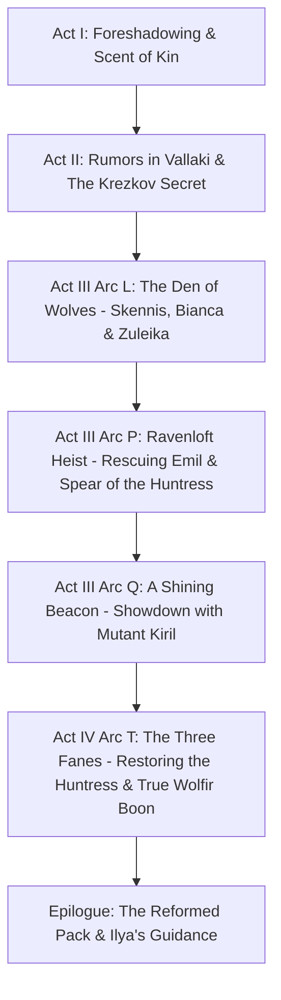

# Ivan Petrovich: Campaign Integration & Master Lore Plan

This document serves as the master DM reference for fully integrating **Ivan Petrovich** into the lore, narrative arcs, and factions of *Curse of Strahd: Reloaded*.

---

## 1. Core Lore Reconciliation & Worldbuilding

### 1.1 The Two Werewolf Clans & The Schism
* **The Ancient Wolfir:** The original champions of the Huntress who ran in the Wild Hunt.
* **The Schism (Centuries Ago):** When Strahd conquered Barovia, the werewolves fractured into two distinct branches:
  * **The Northern Pack (Lake Baratok):** Embraced the beast within, pledged fealty to Strahd, worshipped Mother Night, and practiced cannibalism (consuming humanoid flesh) to achieve terrifying physical power. Strahd granted them permission to hunt outside the Mists.
  * **The Southern Pack / Clan Venatricho (Southern Svalich Woods):** Broke away in total secrecy. Refused to serve Strahd, abandoned flesh-eating, and preserved the Huntress's Wolfir traditions of discipline, honor, and the *Law of the Clean Kill*.
* **The Secret of the Clan:** To protect the clan from the temptation of feral power, the existence of the Northern Pack was kept a strict secret, known only to the reigning Alpha (**Old Skennis**) and recorded in a hidden vault to be passed down only to the chosen heir.
* **What Ivan Knows:** Ivan grew up believing his clan was the only true pack of inherited lycanthropes. He was taught that *infected* lycanthropes were mindless beasts to be avoided, completely unaware of the Northern Pack's existence.

### 1.2 Kiril's Discovery & The Coup
* **The Capture:** During a hunt, Kiril encountered and captured a Northern Pack werewolf. Shocked by its superior strength and speed, Kiril extracted the truth of the Northern Pack and the Schism before killing it.
* **The Confrontation:** Kiril confronted Skennis, accusing his father of intentionally keeping the pack weak and vulnerable.
* **The Pact (3 Months Ago):** When Strahd awakened and demanded fealty from the wild, Kiril sought out Baba Lysaga in Berez. In exchange for submission to Strahd, Lysaga granted him dark alchemical brews. Kiril committed the ultimate taboo—eating human flesh—which unlocked monstrous physical mutations and rapid regeneration.
* **The Coup & The March North:**
  1. Kiril blackmailed Ivan into exile with threats of Strahd's vengeance, ruining Ivan's reputation with a fake farewell letter.
  2. Kiril incapacitated and starved Old Skennis.
  3. Kiril marched the Southern Pack north to Lake Baratok, invaded the Northern Den, deposed Emil Toranescu (sending him to Ravenloft as a prize for Strahd), chained Zuleika in Mother Night's shrine, and forcibly united both packs under his tyrannical alpha rule.

### 1.3 Family Structure & Faction Alignment
* **Old Skennis Petrovich (Father, 64):** Former pack leader. Preserved the ancient lore and trained Ivan strictly to be the shield against Kiril's volatile ambitions.
* **Martha Petrovich (Mother, Deceased, 58):** The spiritual hearth of the family. Her deathbed promise (*"Ivan, protect your brothers... Emil, guide your brothers"*) is Ivan's central moral anchor.
* **Ivan Petrovich (Eldest Brother, 29):** The exiled heir apparent. Blood Hunter (Order of the Pale Moon). Believes his exile was the only way to shield the pack from Strahd's wrath.
* **Kiril Petrovich / "Kiril Stoyanovich" (Middle Brother, 26):** Aggressive and envious. Adopted the epithet *Stoyanovich* ("The Unyielding") upon breaking away from Skennis's teachings. Seduced by Baba Lysaga and Strahd, mutated into a monstrous apex predator through cannibalism and dark alchemy.
* **Emil Petrovich / "Emil Toranescu" (Youngest Brother, 19):** Empathetic confidant. Took the name *Toranescu* upon wedding **Zuleika Toranescu** (sister to Burgomaster Dmitri Krezkov), cementing a union with the Krezkov lycanthrope line.

---

## 2. Campaign Arc Integrations

### Act I: Into the Mists
* **[Arc C - Into the Valley](../../Act%20I%20-%20Into%20the%20Mists/Arc%20C%20-%20Into%20the%20Valley.md):**
  * **Arturi's Werewolf Manuscript (Van Richten's Guide):** When Arturi wagers Van Richten's notes on werewolves, Ivan can immediately identify that Van Richten writes from an outsider's biased perspective—lumping all lycanthropes into the savage, Mother Night-worshipping category and ignoring the ancient inherited Wolfir.
  * **Scent in the Svalich Woods:** Strahd’s wolves patrolling the roads recognize Ivan's scent as a descendant of Skennis, alerting Strahd and his brides early on that the exiled Petrovich heir has returned.

---

### Act II: The Shadowed Town
* **[Arc E - The Missing Vistana](../../Act%20II%20-%20The%20Shadowed%20Town/Arc%20E%20-%20The%20Missing%20Vistana.md) & [Arc F - Lady Wachter's Wish](../../Act%20II%20-%20The%20Shadowed%20Town/Arc%20F%20-%20Lady%20Wachter's%20Wish.md):**
  * Kasimir Velikov and Szoldar Szoldarovich mention that the werewolves were historically dormant and disciplined, but recently exploded into reckless violence under a new, vicious alpha. Ivan recognizes the exact timeline of Kiril’s coup.
* **[Arc I - The Walls of Krezk](../../Act%20II%20-%20The%20Shadowed%20Town/Arc%20I%20-%20The%20Walls%20of%20Krezk.md):**
  * Discovering that Burgomaster Dmitri Krezkov carries lycanthropy reveals that Emil’s marriage to Zuleika tied the Petrovich family directly to the rulers of Krezk.

---

### Act III: The Broken Land (The Werewolf Climax)

#### 1. [Arc L - The Den of Wolves](../../Act%20III%20-%20The%20Broken%20Land/Arc%20L%20-%20The%20Den%20of%20Wolves.md)
* **Encounter with Bianca ([Arc L#L2](../../Act%20III%20-%20The%20Broken%20Land/Arc%20L%20-%20The%20Den%20of%20Wolves.md#L45)):**
  * Bianca recognizes her brother-in-law Ivan. Instead of standard intimidation/persuasion checks, this becomes a deep, emotional dialogue about Kiril’s descent into madness under Baba Lysaga’s influence and how much Kiril has changed.
* **Reunion with Skennis ([Arc L#L4c](../../Act%20III%20-%20The%20Broken%20Land/Arc%20L%20-%20The%20Den%20of%20Wolves.md#L280)):**
  * Old Skennis recognizes Ivan by scent and voice.
  * Skennis reveals the truth: Kiril betrayed the family, poisoned/starved Skennis, struck a deal with Strahd and Baba Lysaga, and handed Emil over to Strahd’s dire wolves.
* **Mother Night’s Shrine & Zuleika ([Arc L#L4e](../../Act%20III%20-%20The%20Broken%20Land/Arc%20L%20-%20The%20Den%20of%20Wolves.md#L381)):**
  * Zuleika explains Emil's perspective: Emil believed Ivan abandoned them and broke their mother's promise, but Emil still stood up to Kiril.
  * Zuleika offers the *Holy Symbol of Ravenkind* in exchange for rescuing Emil from Ravenloft.

#### 2. [Arc P - Ravenloft Heist](../../Act%20III%20-%20The%20Broken%20Land/Arc%20P%20-%20Ravenloft%20Heist.md)
* **Rescuing Emil in the Dungeons:**
  * Ivan meets Emil in Castle Ravenloft's cells. Ivan must clear the air about the letter/exile, heal the rift between them, and reaffirm Martha's dying wish to keep the brothers united.
* **The Spear of the Huntress (*Bloodthorn*):**
  * Located in King Dostron's crypt ([Arc P](../../Act%20III%20-%20The%20Broken%20Land/Arc%20P%20-%20Ravenloft%20Heist.md#L7)), defiled with blood magic. This serves as Ivan's legendary ancestral weapon quest.

#### 3. [Arc Q - A Shining Beacon](../../Act%20III%20-%20The%20Broken%20Land/Arc%20Q%20-%20A%20Shining%20Beacon.md) (The Showdown with Kiril)
* **Fratricidal Confrontation ([Arc Q#Q5b](../../Act%20III%20-%20The%20Broken%20Land/Arc%20Q%20-%20A%20Shining%20Beacon.md#L680)):**
  * Kiril confronts Ivan, Emil, and the party outside the walls.
  * Kiril mocks Ivan’s discipline and the "weak" old Wolfir ways, boasting about the power granted by flesh-eating and Baba Lysaga’s swamp brew.
  * **Phase 2 (Mutant Lycan):** Kiril tearing out his own heart and becoming a grotesque, tooth-covered abomination represents the absolute defilement of the Huntress's gift.
  * **The Law of the Clean Kill:** When Kiril falls, Ivan performs the ancestral funeral rite over his brother—placing stones over Kiril's eyes so his spirit may find peace at the Whispering Wall.

---

### Act IV: Secrets of the Ancient & Epilogue
* **[Arc T - The Three Fanes](../../Act%20IV%20-%20Secrets%20of%20the%20Ancient/Arc%20T%20-%20The%20Three%20Fanes.md):**
  * When the Forest Fane at Yester Hill is reconsecrated and the *Spear of the Huntress* is purified, the Huntress communes directly with Ivan.
  * Ivan’s bloodline connection is fully healed, unlocking his complete *Unleashed* Wolfir state naturally.
* **[Epilogue](../../Act%20IV%20-%20Secrets%20of%20the%20Ancient/Epilogue.md#L312):**
  * With Strahd destroyed and the Fanes restored, Ivan and Emil lead a reformed, noble pack of Wolfir in Barovia, mentoring young lycanthropes like Ilya Krezkov in discipline, honor, and harmony with nature.

---

## 3. DM Implementation Checklist

- [ ] **Establish Surnames:** Ensure NPCs refer to Skennis, Ivan, Kiril, and Emil as the Petrovich line, noting Emil's and Kiril's adopted epithets/surnames.
- [ ] **Prepare Arc L Dialogue Adjustments:** Adjust Bianca's and Skennis's dialogue to recognize Ivan upon arrival at the Lake Baratok den.
- [ ] **Stage the Reunion in Arc P:** Plan the emotional dialogue beat between Ivan and Emil in the dungeons of Castle Ravenloft.
- [ ] **Frame the Spear of the Huntress:** Ensure Ivan learns about *Bloodthorn* in Ravenloft's crypts as an ancestral relic of his goddess.
- [ ] **Prepare the Kiril Boss Fight Narrative:** Emphasize the theological and moral clash between Ivan's *Wolfir discipline* and Kiril's *cannibalistic mutant corruption*.
- [ ] **Fane Reconsecration Boons:** Prepare custom narrative descriptions for when Ivan helps reconsecrate the Forest Fane in Arc T.
